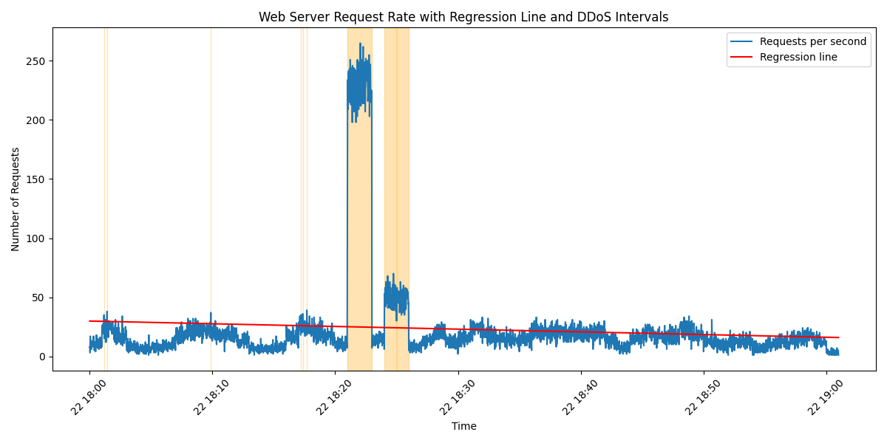

# DDoS Attack Detection Using Regression Analysis

## 1. Event Log File
The analysis uses the web server log file:
`g_lomidze25_63947_server.log`

---

## 2. Objective
The goal of this task is to **detect potential DDoS attack intervals** by analyzing web server request logs. Regression analysis is used to model normal traffic patterns, where significant deviations above a calculated threshold indicate potential abnormal activity or a denial-of-service attack.

---

## 3. Methodology

1.  **Load the log file** and parse timestamps in multiple common formats:  
    * `[12/Feb/2026:12:01:45]`  
    * `2026-02-12 12:01:45`  
2.  **Aggregate requests per second** to create a time series representing server load.
3.  **Perform regression analysis** to model the baseline traffic trends using the following logic:
    * Fit a linear model to the time series.
    * Calculate a dynamic threshold:  
        $$threshold = \mu + 3\sigma$$  
        *(Where $\mu$ is the mean of predicted values and $\sigma$ is the standard deviation)*.
4.  **Detect DDoS activity** where actual requests exceed this threshold.
5.  **Merge consecutive spikes** into defined attack intervals for reporting clarity.

## 4. Visualization



- **Blue line:** requests per second  
- **Red line:** regression model of normal traffic  
- **Orange areas:** detected DDoS intervals
  
---
## 5. Conclusion
Regression analysis effectively identifies abnormal traffic spikes that correspond to DDoS attacks. By utilizing statistical thresholding (3σ), we can distinguish between natural traffic growth and malicious surges. This approach allows security teams to reproduce and verify attack intervals for better incident response.


---

## 6. Python Code (Main Fragments)

```python
import pandas as pd
import numpy as np
from sklearn.linear_model import LinearRegression

# Aggregate requests per second
df_counts = df.groupby('timestamp').size().reset_index(name='count')

# Prepare data for Regression
X = np.array(range(len(df_counts))).reshape(-1, 1)
y = df_counts['count'].values

# Regression modeling
reg = LinearRegression()
reg.fit(X, y)
y_pred = reg.predict(X)

# Detect DDoS Threshold
threshold = y_pred.mean() + (3 * y_pred.std())
ddos_events = df_counts[df_counts['count'] > threshold]


